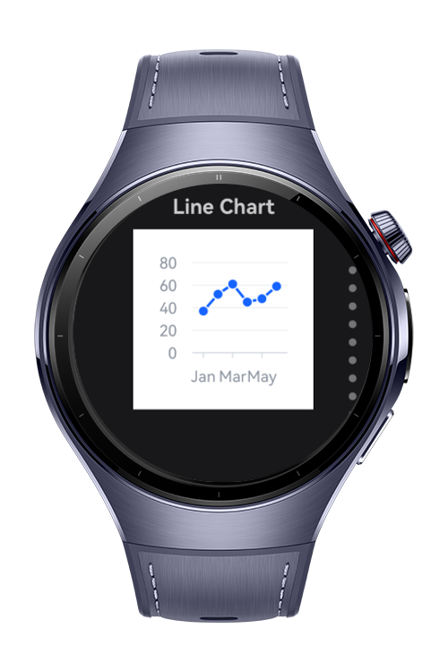

> **Note:** To access all shared projects, get information about environment setup, and view other guides, please visit [Explore-In-HMOS-Wearable Index](https://github.com/Explore-In-HMOS-Wearable/hmos-index).

# How to use Vchart
This project demonstrates the usage of Vchart, a third-party ohpm package for displaying various types of charts on HarmonyOS screens. The project showcases different chart visualizations and their implementations.

# Preview
<div>



</div>

# Use Cases
- Show different charts

# Tech Stack

- **Languages**: ArkTS, ArkUI
- **Frameworks**: HarmonyOS SDK 5.1.0(18)
- **Tools**: DevEco Studio Vers 5.1.0.820
- **Libraries**: @kit.ArkUI, @kit.MapKit, @visactor/harmony-vchart


# Directory Structure
```
entry/src/main/ets/
|---components
|---|---ChartPage.ets
|---entryability
|---|---EntryAbility.ets
|---entrybackupability
|---|---EntryBackupAbility.ets
|---interfaces
|---|---ChartInterfaces.ets
|---pages
|---|---Index.ets
|---services
|---|---ChartSpecs.ets
|---viewmodels
|---|---ChartViewModel.ets
```

# Constraints and Restrictions
## Supported Device
- Huawei Watch 5

# LICENSE
**Vchart App** is distributed under the terms of the MIT License.
See the [license](/LICENSE) for more information.